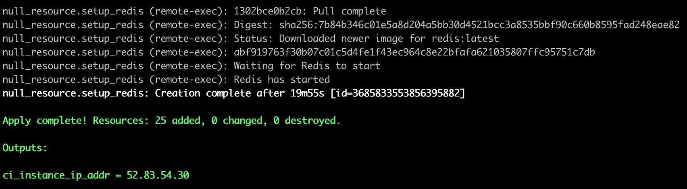

# reconciliation-system-devops

## How to use

### Install terraform

* Follow terraform [installation docs](https://www.terraform.io/downloads.html).
* You can use `terraform version` to verify whether you had install successfully. [The version should more than 0.12.18]

### Prepare

* Make sure you are in the `terraform` folder.
* Copy `secret.auto.tfvars.example` to `secret.auto.tfvars` in terraform folder, and fill in the blank of `access_key` and `secret_key` from AWS account credential.
* Copy `terraform.tfvars.example` to `terraform.tfvars` in terraform folder, and fill in the value of each properties.
> Warning: The port **80**, **8080**, **443** is not available in AWS China, please avoid to use these ports.
* Use `terraform init` to initialize the module we use.
* Before execute the script, you can use `terraform plan` to verify the code and see what will happen when you execute the script.

### Create instance

``` bash
terraform apply
```

This script will create two instances on aws. The ci instance config is located at `./terraform/aws_ec2_ci.tf`

### Verify

* After a time of period, If you see the output says it `Apply complete!` as the picture shows below, That means you execute the script successfully.

* From the output, you can know the value of `ci_instance_ip_addr`. It means the IP address of CI instance, you can access the Jenkins page by using that IP address with the port that you specify it in the `terraform.tfvars` file. Such as `http://52.83.54.30:8001`.
* When you access to the Jenkins page, it will ask you to input the `initialAdminPassword`, You can ssh to the instance to get this password. The key file is located at `terraform/secrets` folder.
* Use `ssh -i **.pem ubuntu@ci_instance_ip_addr` to login to the instance, and you can get the `initialAdminPassword`.

### Destroy instance

``` bash
terraform destroy
```

This script will destroy every resource that you created by using `terraform apply`.
